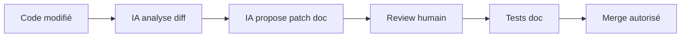
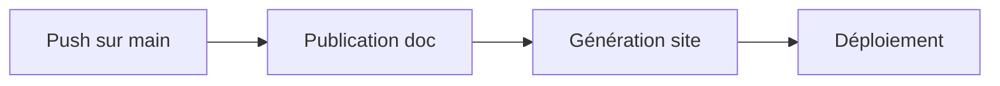
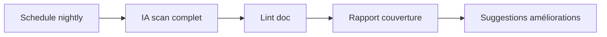

# Guide Docs-as-Code

Principes et workflow pour la documentation versionnée avec assistance IA.

## 🎯 Principes Docs-as-Code

### 1. Documentation comme code
- **Versionnée** dans Git (commits, branches, PR)
- **Testée** automatiquement (liens, style, couverture)
- **Reviewée** par des humains (approbations requises)
- **Déployée** via CI/CD

### 2. IA comme assistant
- **Propose** des améliorations (patches, suggestions)
- **N'impose** jamais de changements automatiques
- **Aide** à détecter les trous et incohérences
- **Génère** des résumés et notes de version

## 🔄 Workflow Git

### Sur une Pull Request


1. **Déclencheur** : PR ouverte/ mise à jour
2. **IA analyse** : git diff + docs existantes
3. **IA propose** : patch sur fichiers doc
4. **Review humaine** : validation ou rejet
5. **Tests automatiques** : liens, style, couverture
6. **Merge** : seulement si tout validé

### Sur push main


### Nightly (schedule)


## 🛠️ Outils et configuration

### Pre-commit hooks
```yaml
# .pre-commit-config.yaml
repos:
  - repo: https://github.com/markdownlint/markdownlint
    rev: v0.12.0
    hooks:
      - id: markdownlint
  - repo: local
    hooks:
      - id: doc-coverage
        name: Check doc coverage
        entry: python scripts/test_coverage.py
        language: system
```

### GitHub Actions
```yaml
# .github/workflows/docs-on-pr.yml
on:
  pull_request:
    paths:
      - 'src/**'
      - 'games/**'

jobs:
  doc-patch:
    runs-on: ubuntu-latest
    steps:
      - uses: actions/checkout@v4
      - name: IA propose doc patch
        run: python scripts/ia-doc-patch.py
      - name: Tests documentation
        run: python -m pytest tests/
```

## 📋 Templates et checklists

### PR Template
```markdown
## Description
Changes proposed in this PR.

## Documentation checklist
- [ ] Doc updated for new features
- [ ] Examples added/updated
- [ ] API docs updated
- [ ] How-to guides updated
- [ ] Tests pass

## IA suggestions
<!-- L'IA ajoutera ses suggestions ici -->
```

### Review checklist
- [ ] Documentation à jour
- [ ] Liens fonctionnels
- [ ] Exemples testés
- [ ] Style cohérent
- [ ] Couverture suffisante

## 🤖 Scripts IA

### ia-doc-patch.py
Analyse le git diff et propose des patches de documentation.

```python
# Entrées
git_diff = get_git_diff()
related_docs = find_related_docs(git_diff)
style_guide = load_style_guide()

# Sorties
patch = generate_patch(git_diff, related_docs, style_guide)
summary = generate_summary(patch)
```

### ia-doc-coverage.py
Détecte les trous dans la documentation.

```python
# Checks
- Fonctions publiques sans docstring
- Endpoints non documentés
- Exemples manquants
- Liens cassés
```

### ia-release-notes.py
Génère les notes de version automatiquement.

```python
# Entrées
commits = get_commits_since_last_tag()
conventionnal = parse_commits(commits)

# Sorties
release_notes = format_release_notes(conventionnal)
```

## 📊 Métriques et rapports

### Couverture documentation
```bash
# Rapport de couverture
python scripts/ia-doc-coverage.py --report

# Sortie attendue
Coverage: 87% (missing: 13 functions)
Examples: 65% (missing: 5 endpoints)
Links: 98% (2 broken)
```

### Qualité documentation
```bash
# Lint et style
markdownlint src/**/*.md
pydocstyle src/**/*.py

# Tests
pytest tests/test_*.py
```

## 🔧 Personnalisation

### Style guide
```yaml
# .docs/config.yml
style:
  markdown:
    line_length: 120
    toc: true
  python_docstrings:
    style: google
    require_returns: true
```

### IA configuration
```yaml
ia:
  provider: "openai"
  model: "gpt-4"
  temperature: 0.3
  max_tokens: 2000
```

## 🚀 Bonnes pratiques

### Écriture
- **Titres clairs** et hiérarchiques
- **Exemples** à chaque fois que possible
- **Liens** internes bien maintenus
- **Formatage** cohérent

### Versionnage
- **Commits atomiques** (doc + code liés)
- **Messages conventionnels**
- **Tags** pour chaque version

### Review
- **Reviewers** connaissent le domaine
- **Approvals** requis avant merge
- **Tests** doivent passer

---

*Pour voir la configuration complète, voir [.docs/config.yml](../.docs/config.yml).*
